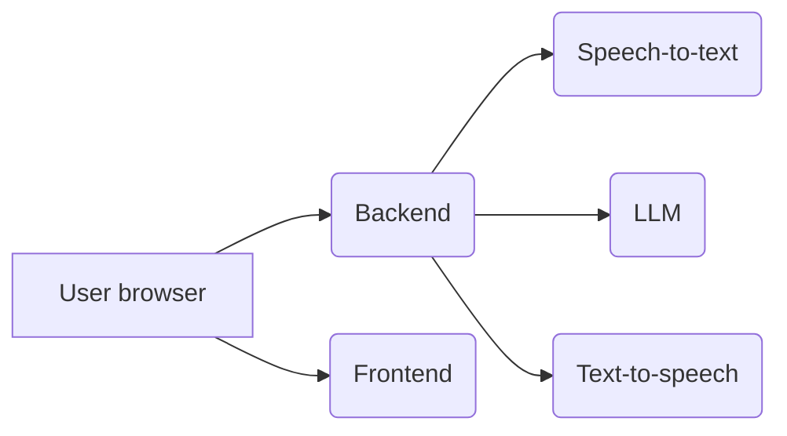

# Unmute — İTÜ Student Convince AI (Voice Agent)

> **This is a customized fork of [Kyutai Unmute](https://github.com/kyutai-labs/unmute)**
> integrated into the İTÜ Student Convince AI project.
>
> The original Unmute browser-based voice chat system has been adapted to work with
> our **PyQt6 desktop client**, local **Silero VAD**, local **DiariZen** speaker
> diarisation, and **OpenAI Realtime `gpt-realtime-2.1`** for speech-to-speech.
>
> For the full İTÜ project architecture, see:
> - [`README.md`](../../README.md) — project overview
> - [`docs/ARCHITECTURE.md`](../../docs/ARCHITECTURE.md) — system architecture
> - [`docs/SETUP.md`](../../docs/SETUP.md) — setup & launch instructions

---

## What We Use from Unmute

This directory contains two subsystems we leverage:

### 1. DiariZen Speaker Diarisation (`diarizen_src/`)

The DiariZen model (`BUT-FIT/diarizen-wavlm-large-s80-md-v2`) runs **locally on the client device** to identify who is speaking. This is loaded by `PipelineLoaderWorker` in [`client/workers.py`](../../client/workers.py) and used by `ResponseGeneratorWorker` to produce speaker-labeled conversation turns.

Speaker colors in the desktop client:
- **Speaker 0** → Blue
- **Speaker 1** → Teal
- **Speaker 2** → Purple

### 2. Turkish Pipeline Adapters (`services/turkish/`)

The Turkish STT/TTS adapters provided the foundation for our standalone speech backend at [`backend/speech_backend/`](../speech_backend/). The adapters speak the same WebSocket/msgpack protocol as Kyutai services.

**What changed from the upstream Turkish pipeline:**

| Component | Original Unmute | İTÜ Version |
|-----------|----------------|-------------|
| STT | faster-whisper (CT2) | OpenAI Realtime speech input |
| LLM | Gemma 4 E2B-it (~2B) | OpenAI Realtime `gpt-realtime-2.1` |
| TTS | Sherpa-ONNX Piper or Supertonic | OpenAI Realtime audio output |
| Frontend | Next.js browser app | PyQt6 desktop client |
| Client audio | Opus over WebSocket in browser | Raw PCM via HTTP POST from native client |
| Diarisation | Not present | DiariZen local model |

### 3. What We DON'T Use

- **Kyutai STT** — replaced by OpenAI Realtime in `speech_backend/`
- **Kyutai TTS** — replaced by OpenAI Realtime audio output in `speech_backend/`
- **Browser frontend** (`frontend/`) — replaced by `client/desktop_client.py`
- **Docker Compose / Dockerless / Docker Swarm** Unmute deployment — replaced by our own Docker setup
- **OpenRouter / VLLM LLM serving** — replaced by the OpenAI Realtime speech server

---

## Directory Structure

```
backend/voice_agent/
├── diarizen_src/          — DiariZen speaker diarisation (used as-is)
│   ├── dscore/            — Diarisation scoring metrics
│   ├── pyannote-audio/    — PyAnnote Audio framework (dependency)
│   └── recipes/           — DiariZen training recipes
├── services/turkish/      — Turkish STT/TTS WebSocket adapters (foundation)
├── unmute/                — Unmute Python backend library
│   ├── llm/               — LLM system prompt handling
│   └── loadtest/          — Load testing client
├── docs/
│   ├── browser_backend_communication.md  — Original WebSocket protocol docs
│   └── turkish_low_latency_pipeline.md   — Turkish pipeline guide (UPDATED)
├── README.md              — This file
├── SWARM.md               — Docker Swarm deployment (upstream reference)
├── CONTRIBUTING.md        — Contribution guide (upstream)
├── voices.yaml            — Voice character definitions
└── .github/               — PR template
```

---

## Running the Voice Agent Components

### DiariZen (local, inside desktop client)

Loaded automatically when the desktop client starts:
```bash
uv run python client/desktop_client.py
```

### Turkish Pipeline (standalone, via Podman)

```bash
services/turkish/podman_pipeline.sh up
```

See [`docs/turkish_low_latency_pipeline.md`](docs/turkish_low_latency_pipeline.md) for details.

### Standalone Speech Server

The primary speech server lives in `backend/speech_backend/`, not here:
```bash
source .venv/bin/activate
python backend/speech_backend/server.py
```

---

## Testing

```bash
# Full project test suite
pytest tests/ -v

# Voice agent specific tests
pytest tests/voice_agent/ -v
```

---

## Original Unmute Documentation

For reference, the original Unmute README content follows below. Some sections (Docker Compose setup, browser frontend, Kyutai STT/TTS) are **not applicable** to the İTÜ project and are preserved only for historical context.

---

# Unmute (Original README)

Try it out at [Unmute.sh](https://unmute.sh)!

Unmute is a system that allows text LLMs to listen and speak by wrapping them in Kyutai's Text-to-speech and Speech-to-text models.
The speech-to-text transcribes what the user says, the LLM generates a response in text, and the text-to-speech reads it out loud.
Both the STT and TTS are optimized for low latency and the system works with any text LLM you like.

If you want to use Kyutai STT or Kyutai TTS separately, check out [kyutai-labs/delayed-streams-modeling](https://github.com/kyutai-labs/delayed-streams-modeling).
A pre-print about the models is available [here](https://arxiv.org/pdf/2509.08753).

On a high level, it works like this:



- The user opens the Unmute website, served by the **frontend**.
- By clicking "connect", the user establishes a websocket connection to the **backend**, sending audio and other metadata back and forth in real time.
  - The backend connects via websocket to the **speech-to-text** server, sending it the audio from the user and receiving back the transcription in real time.
  - Once the speech-to-text detects that the user has stopped speaking and it's time to generate a response, the backend connects to an **LLM** server to retrieve the response. We serve the LLM using [OpenRouter](https://openrouter.ai/), but you can also host your own using [VLLM](https://github.com/vllm-project/vllm).
  - As the response is being generated, the backend feeds it to the **text-to-speech** server to read it out loud, and forwards the generated speech to the user.

## Setup

> [!NOTE]
> If something isn't working for you, don't hesitate to open an issue. We'll do our best to help you figure out what's wrong.

Requirements:
- Hardware: a GPU with CUDA support and at least 16 GB VRAM. Architecture must be x86_64, no aarch64 support is planned.
- OS: Linux, or Windows with WSL ([installation instructions](https://ubuntu.com/desktop/wsl)). Running on Windows natively is not supported (see [#84](https://github.com/kyutai-labs/unmute/issues/84)). Neither is running on Mac (see [#74](https://github.com/kyutai-labs/unmute/issues/74)).

We provide multiple ways of deploying your own [unmute.sh](unmute.sh):

| Name                      | Number of gpus | Number of machines | Difficulty | Documented | Kyutai support |
|---------------------------|----------------|--------------------|------------|------------|----------------|
| Docker Compose            | 1+             | 1                  | Very easy  |✅         |✅              |
| Dockerless                | 1 to 3         | 1 to 5             | Easy       |✅         |✅              |
| Docker Swarm              | 1 to ~100      | 1 to ~100          | Medium     |✅         |❌              |

Since Unmute is a complex system with many services that need to be running at the same time, we recommend using [**Docker Compose**](https://docs.docker.com/compose/) to run Unmute.

### LLM access on Hugging Face Hub

You can use any LLM you want.
In production, we use GPT OSS 120B served over OpenRouter.
In the default local setup (Docker Compose/Dockerless), Unmute uses [Gemma 3 1B](https://huggingface.co/google/gemma-3-1b-it) as the LLM.

> **⚠️ İTÜ note:** The active speech server now uses OpenAI Realtime `gpt-realtime-2.1`. The older Gemma path is kept only as legacy `SPEECH_PROVIDER=cascaded` code.

This model is freely available but requires you to accept the conditions to access it:

1. Create a Hugging Face account.
2. Accept the conditions on the model page.
3. [Create an access token.](https://huggingface.co/docs/hub/en/security-tokens)
4. Add the token into your `~/.bashrc` as `export HUGGING_FACE_HUB_TOKEN=hf_...`

### Start Unmute

Make sure you have [**Docker Compose**](https://docs.docker.com/compose/) installed and the [NVIDIA Container Toolkit](https://docs.nvidia.com/datacenter/cloud-native/container-toolkit/latest/install-guide.html).

```bash
echo $HUGGING_FACE_HUB_TOKEN
docker compose up --build
```

### Using multiple GPUs

On [Unmute.sh](https://unmute.sh/), we run STT, TTS, and VLLM on separate GPUs for improved latency (~450ms vs ~750ms single-GPU).

### Running without Docker

```bash
./dockerless/start_frontend.sh
./dockerless/start_backend.sh
./dockerless/start_llm.sh        # Needs 6.1GB of vram
./dockerless/start_stt.sh        # Needs 2.5GB of vram
./dockerless/start_tts.sh        # Needs 5.3GB of vram
```

### HTTPS support

For simplicity, we omit HTTPS support from the Docker Compose and Dockerless setups. See [SWARM.md](/SWARM.md) for production HTTPS via Docker Swarm.

## Production deployment with Docker Swarm

See [SWARM.md](./SWARM.md) for how we deploy and scale [unmute.sh](https://unmute.sh).

## Modifying Unmute

### Subtitles and dev mode

Press "S" to turn on subtitles. Press "D" in dev mode for debug view.

### Changing characters/voices

Characters' voices and prompts are defined in [`voices.yaml`](voices.yaml). System prompts with dynamic elements are in [`unmute/llm/system_prompt.py`](unmute/llm/system_prompt.py).

> **İTÜ note:** We use our own system prompt at [`SYSTEM_PROMPT.md`](../../SYSTEM_PROMPT.md) for the İTÜ advisor persona.

### Using external LLM servers

The Unmute backend works with any OpenAI-compatible LLM server. By default it uses VLLM for a local setup.

### Swapping the frontend

The backend and frontend communicate over WebSocket using a protocol based on the [OpenAI Realtime API](https://platform.openai.com/docs/guides/realtime).

> **İTÜ note:** Our desktop client (`client/desktop_client.py`) communicates with the speech server at `backend/speech_backend/server.py` via HTTP POST (`/chat_stream`) rather than the OpenAI Realtime WebSocket protocol.

### Tool calling

Contributions welcome for tool calling support in Unmute.

## Developing Unmute

### Install pre-commit hooks

```bash
pre-commit install --hook-type pre-commit
```

### Run backend (dev mode, with autoreloading)

```bash
uv run fastapi dev unmute/main_websocket.py
```

### Run backend (production)

```bash
uv run fastapi run unmute/main_websocket.py
```

### Run loadtest

```bash
uv run unmute/loadtest/loadtest_client.py --server-url ws://localhost:8000 --n-workers 16
```
